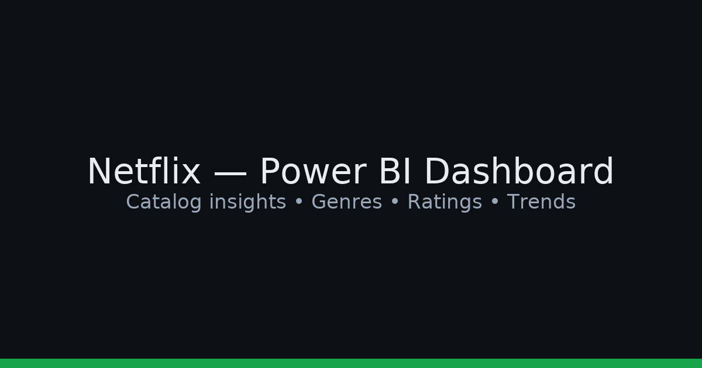

# Netflix Movies & TV Shows — Power BI Dashboard



Interactive Power BI dashboard built from Netflix catalog datasets with optional IMDb enrichments.
It explores title growth over time, content mix by type/genre/country, maturity ratings, and key KPIs.

## 📦 Files included
- `reports/Netflix_Dashboard.pbix`  ← open in Power BI Desktop
- `data/raw/netflix_titles.csv`      ← base catalog
- `data/raw/netflix_titles_with_IMDB.csv` ← (optional) enriched with IMDb fields
- `assets/banner.png`

> If the PBIX exceeds 100 MB, push via **Git LFS** or upload it as a **GitHub Release** and link it from the README.

## ▶️ How to use
1. Install **Power BI Desktop**.
2. Open `reports/Netflix_Dashboard.pbix`.
3. If prompted, set datasource to the repo path:
   - `data/raw/netflix_titles.csv`
   - `data/raw/netflix_titles_with_IMDB.csv` (if used in your model)
4. Refresh and interact with the report.

## 🚀 Publish (optional)
- Publish to **Power BI Service** (Home ▸ Publish).  
- Grab the share link or embed URL and add it to your portfolio.

## 🧱 Repo structure
```
.
├─ assets/
├─ data/
│  ├─ raw/
│  └─ processed/   # gitignored
├─ reports/
│  ├─ Netflix_Dashboard.pbix
│  └─ figures/     # export images here
├─ .github/workflows/ci.yml
├─ .gitignore
├─ LICENSE
└─ README.md
```

## ✅ CI
A tiny GitHub Actions workflow checks the repo on push so you get a green check.

## © License
MIT © Lohith B N
